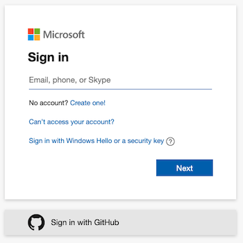

These examples can apply to virtually any Azure DevOps pipeline deployment, provided that you already have some existing automated tests, and are either the maintainer or an admin of the target repository.

## What You'll Need
* [Azure Account](https://dev.azure.com/login)
* [SauceLabs Account](https://saucelabs.com/sign-up)
* A git repository hosting service (GitHub or BitBucket)

## Create the Saucectl Configuration

Create the `.sauce` directory at the root of your project and add a `config.yaml` file that points [`saucectl`](cli-reference.md) to your existing `tests` directory. 

With the `suites` field you can specify a group of tests as well as the browser `settings` you wish to use.

Below are some examples:

<!--DOCUSAURUS_CODE_TABS-->
<!--puppeteer-->

```yaml
apiVersion: v1alpha
metadata:
  name: Testing Puppeteer Support
  tags:
    - e2e
    - release team
    - other tag
  build: Release $CI_COMMIT_SHORT_SHA
files:
  - ./tests
suites:
  - name: "chrome"
    match: ".*.(spec|test).js$"
    settings:
      browserName: "chrome"
image:
  base: saucelabs/stt-puppeteer-jest-node
  version: v0.1.8
sauce:
  region: us-west-1
```

<!--playwright-->

```yaml
apiVersion: v1alpha
metadata:
  name: Testing Playwright Support
  tags:
    - e2e
    - release team
    - other tag
  build: Release $CI_COMMIT_SHORT_SHA
files:
  - ./tests
suites:
  - name: "chrome"
    match: ".*.(spec|test).js$"
    settings:
      browserName: "chrome"
image:
  base: saucelabs/stt-playwright-jest-node
  version: v0.1.9
sauce:
  region: us-west-1
```

<!--testcafe-->

```yaml
apiVersion: v1alpha
metadata:
  name: Testing TestCafe Support
  tags:
    - e2e
    - release team
    - other tag
  build: Release $CI_COMMIT_SHORT_SHA
files:
  - ./tests
suites:
  - name: "chrome"
    match: ".*.(spec|test).js$"
    settings:
      browserName: "chrome"
image:
  base: saucelabs/stt-testcafe-node
  version: v0.1.7
sauce:
  region: us-west-1
```

<!--cypress-->

```yaml
apiVersion: v1alpha
metadata:
  name: Testing Cypress Support
  tags:
    - e2e
    - release team
    - other tag
  build: Release $CI_COMMIT_SHORT_SHA
files:
  - ./tests
suites:
  - name: "chrome"
    match: ".*.(spec|test).js$"
    settings:
      browserName: "chrome"
image:
  base: saucelabs/stt-cypress-mocha-node
  version: v0.1.11
sauce:
  region: us-west-1
```

<!--END_DOCUSAURUS_CODE_TABS-->

## Azure DevOps Project Setup

The first step is to ensure you have an Azure DevOps account, and to log in with your git hosting provider username; the examples below use GitHub authentication.



The second step is to choose a project/target repository where you wish to edit or add the [`azure-pipelines.yml`](https://docs.microsoft.com/en-us/azure/devops/pipelines/yaml-schema?view=azure-devops&tabs=schema%2Cparameter-schema) file.

### Set Environment Variables

After successfully creating and linking your azure project, the next step is to set project variables. 
* To the left of the UI, select __Variables__:

    

* Add your Sauce Labs account credentials and ensure that you select the checkbox to __keep the value secret__.
    
    
    
## Configure the Azure Pipeline

In the root directory of your project, add the `azure-pipelines.yml` file. You can either add the file directly in your source code repository (e.g. in GitHub, GitLab, BitBucket, etc.), or you can use Azure's template file and edit the file in the UI. 

Below is an example Azure pipeline configuration:

```yaml
trigger:
  - master

jobs:
  - job: testrunnerToolkit
    variables:
      CI: true
    pool:
      vmImage: 'ubuntu-latest'
    container: saucelabs/stt-puppeteer-jest-node:v0.20

    steps:
      - checkout: self
        displayName: 'Checkout Code'
      - script: sudo chown -R $USER:$(id -gn $USER) /github/home
        name: Workaround for container permissions
      - script: sudo ln -s /home/seluser/.cache /github/home/.cache
        name: Workaround for container folder
      - task: NodeTool@0
        inputs:
          versionSpec: 12.x
      - script: npm install
        displayName: 'Install node dependencies'
      - script: saucectl run -c ./.sauce/puppeteer.yml
        env:
          SAUCE_ACCESS_KEY: $(SAUCE_ACCESS_KEY)
          SAUCE_USERNAME: $(SAUCE_USERNAME)
        displayName: 'Run Testrunner Toolkit'

```

Save the file and select __Run__ in the upper right corner of the UI:

   
   
After a successful Azure pipeline run, you will see similar console output like below:

   
   
---