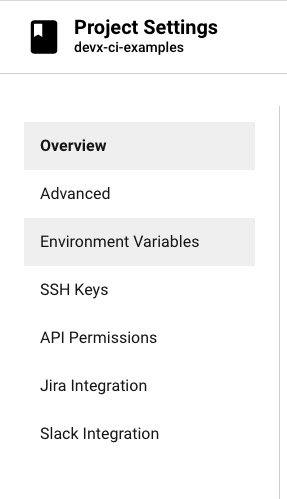
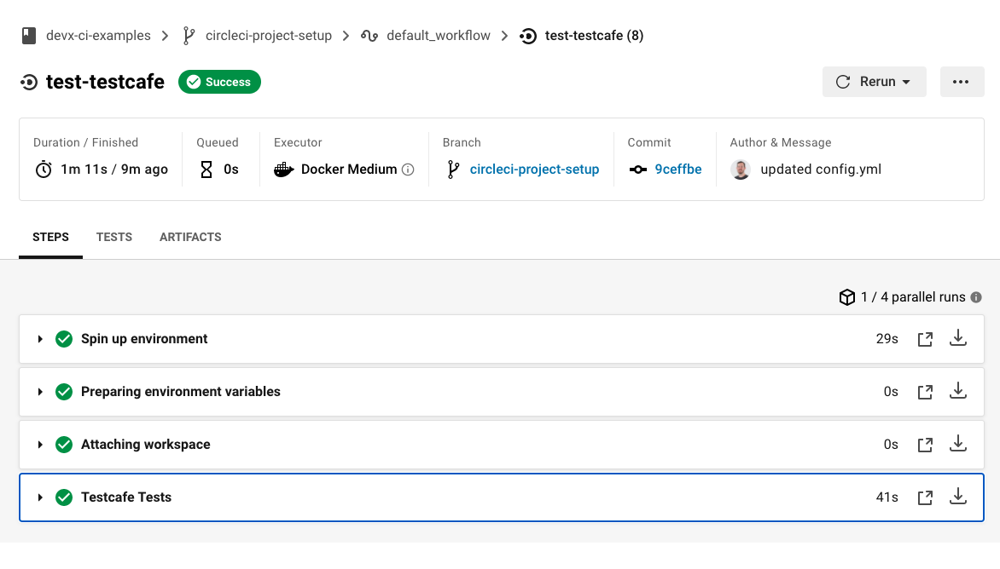

These examples can apply to virtually any CirceCI deployment, provided that you already have some existing automated tests, and are either the maintainer or an admin of the target repository.

## What You'll Need

* [CirceCI Account](https://circleci.com/signup/)
* [SauceLabs Account](https://saucelabs.com/sign-up)
* A git repository hosting service (GitHub or BitBucket)

## Create the Saucectl Configuration

Create the `.sauce` directory at the root of your project and add a `config.yaml` file that points [`saucectl`](cli-reference.md) to your existing `tests` directory. 

With the `suites` field you can specify a group of tests as well as the browser `settings` you wish to use.

Below are some examples:

<!--DOCUSAURUS_CODE_TABS-->
<!--puppeteer-->

```yaml
apiVersion: v1alpha
metadata:
  name: Testing Puppeteer Support
  tags:
    - e2e
    - release team
    - other tag
  build: Release $CI_COMMIT_SHORT_SHA
files:
  - ./tests
suites:
  - name: "chrome"
    match: ".*.(spec|test).js$"
    settings:
      browserName: "chrome"
image:
  base: saucelabs/stt-puppeteer-jest-node
  version: v0.1.8
sauce:
  region: us-west-1
```

<!--playwright-->

```yaml
apiVersion: v1alpha
metadata:
  name: Testing Playwright Support
  tags:
    - e2e
    - release team
    - other tag
  build: Release $CI_COMMIT_SHORT_SHA
files:
  - ./tests
suites:
  - name: "chrome"
    match: ".*.(spec|test).js$"
    settings:
      browserName: "chrome"
image:
  base: saucelabs/stt-playwright-jest-node
  version: v0.1.9
sauce:
  region: us-west-1
```

<!--testcafe-->

```yaml
apiVersion: v1alpha
metadata:
  name: Testing TestCafe Support
  tags:
    - e2e
    - release team
    - other tag
  build: Release $CI_COMMIT_SHORT_SHA
files:
  - ./tests
suites:
  - name: "chrome"
    match: ".*.(spec|test).js$"
    settings:
      browserName: "chrome"
image:
  base: saucelabs/stt-testcafe-node
  version: v0.1.7
sauce:
  region: us-west-1
```

<!--cypress-->

```yaml
apiVersion: v1alpha
metadata:
  name: Testing Cypress Support
  tags:
    - e2e
    - release team
    - other tag
  build: Release $CI_COMMIT_SHORT_SHA
files:
  - ./tests
suites:
  - name: "chrome"
    match: ".*.(spec|test).js$"
    settings:
      browserName: "chrome"
image:
  base: saucelabs/stt-cypress-mocha-node
  version: v0.1.11
sauce:
  region: us-west-1
```

<!--END_DOCUSAURUS_CODE_TABS-->

## CircleCI Project Setup

The first step is to ensure you have a CircleCI account, and to login with your git hosting provider username; the examples below use GitHub authentication. 

1. Log in to CircleCI
2. Choose the desired repo and click "Set Up Project"
3. Select Add Config (or Use Existing Config). This creates a new branch in your project called `circle-ci-project-setup`

> Do not worry if your project fails to build. You need to modify the `config.yml` manually anyway.

### Add Project Environment Variables

In order for CircleCI to communicate with Sauce Labs you need to authenticate with project environment variables.

1. In CirceCI, go to your __Project Settings__
    
    

2. Select __Environment Variables__

    
    
3. Add variables for your [Sauce Labs account credentials](https://app.saucelabs.com/user-settings) as `SAUCE_USERNAME` and `SAUCE_ACCESS_KEY` respectively
    
    


### Modify the CirceCI Configuration

In the root of your project directory, create the `.circleci` directory if it doesn't already exist, and open/create `config.yml`. Below are some examples of how to configure Testrunner Toolkit with CircleCI:

<!--DOCUSAURUS_CODE_TABS-->
<!--puppeteer-->

```yaml
version: 2.1
jobs:
  setup:
    working_directory: ~/app
    docker:
      - image: circleci/node:10.12
    steps:
      - checkout
      - run:
          name: Install Dependencies
          command: npm install
      - run:
          name: Build Project
          command: |
            npm run build
      - persist_to_workspace:
          root: ~/app
          paths:
            - .
  test-puppeteer:
    working_directory: ~/app
    docker:
      - image: saucelabs/stt-puppeteer-jest-node:v0.2.0
    steps:
      - attach_workspace:
          at: ~/app
      - run:
          name: Puppeteer Tests
          command: |
            saucectl run -c ./.sauce/puppeteer.yml
          environment:
            BUILD_ID: $CIRCLE_BUILD_NUM
            BUILD_ENV: CircleCI
workflows:
  version: 2
  default_workflow:
    jobs:
      - setup
      - test-puppeteer:
          requires:
            - setup
```

<!--playwright-->

```yaml
version: 2.1
jobs:
  setup:
    working_directory: ~/app
    docker:
      - image: circleci/node:10.12
    steps:
      - checkout
      - run:
          name: Install Dependencies
          command: npm install
      - run:
          name: Build Project
          command: |
            npm run build
      - persist_to_workspace:
          root: ~/app
          paths:
            - .
  test-playwright:
    working_directory: ~/app
    docker:
      - image: saucelabs/stt-playwright-jest-node:v0.2.0
    steps:
      - attach_workspace:
          at: ~/app
      - run:
          name: Playwright Tests
          command: |
            saucectl run -c ./.sauce/playwright.yml
          environment:
            BUILD_ID: $CIRCLE_BUILD_NUM
            BUILD_ENV: CircleCI
workflows:
  version: 2
  default_workflow:
    jobs:
      - setup
      - test-playwright:
          requires:
            - setup
```

<!--testcafe-->

```yaml
version: 2.1
jobs:
  setup:
    working_directory: ~/app
    docker:
      - image: circleci/node:10.12
    steps:
      - checkout
      - run:
          name: Install Dependencies
          command: npm install
      - run:
          name: Build Project
          command: |
            npm run build
      - persist_to_workspace:
          root: ~/app
          paths:
            - .
  test-testcafe:
    working_directory: ~/app
    docker:
      - image: saucelabs/stt-testcafe-node:v0.1.7
    steps:
      - attach_workspace:
          at: ~/app
      - run:
          name: Testcafe Tests
          command: |
            saucectl run -c ./.sauce/testcafe.yml
          environment:
            BUILD_ID: $CIRCLE_BUILD_NUM
            BUILD_ENV: CircleCI
workflows:
  version: 2
  default_workflow:
    jobs:
      - setup
      - test-testcafe:
          requires:
            - setup
```

<!--cypress-->

```yaml
version: 2.1
jobs:
  setup:
    working_directory: ~/app
    docker:
      - image: circleci/node:10.12
    steps:
      - checkout
      - run:
          name: Install Dependencies
          command: npm install
      - run:
          name: Build Project
          command: |
            npm run build
      - persist_to_workspace:
          root: ~/app
          paths:
            - .
  test-cypress:
    working_directory: ~/app
    docker:
      - image: saucelabs/stt-cypress-mocha-node:v0.1.11
    steps:
      - attach_workspace:
          at: ~/app
      - run:
          name: Cypress Tests
          command: |
            saucectl run -c ./.sauce/cypress.yml
          environment:
            BUILD_ID: $CIRCLE_BUILD_NUM
            BUILD_ENV: CircleCI
workflows:
  version: 2
  default_workflow:
    jobs:
      - setup
      - test-cypress:
          requires:
            - setup
```

<!--END_DOCUSAURUS_CODE_TABS-->

> You can reference our example `config.yml` [here](https://github.com/saucelabs/testrunner-toolkit/blob/master/.circleci/config.yml).

Commit the updated `config.yml` to your git hosting service provider. Navigate back to the CirceCI dashboard to see your build pass.

   
